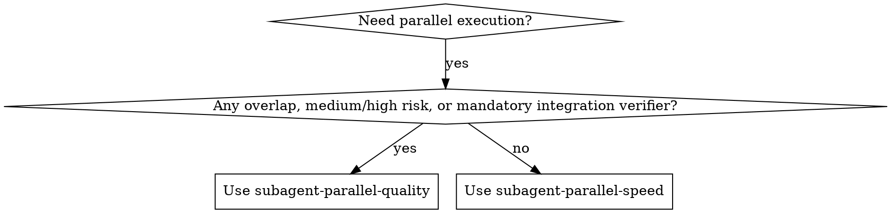

# Subagent Parallel Quality

Execute independent implementation tracks in parallel with adaptive review loops per track and a required final integration verifier.

**Core principle:** Parallel implementation is fast only when ownership boundaries, triage routing, and verification loops are deterministic.

## When to Use

Use when:
- You have an implementation plan with 2+ independent tracks
- Tracks can be scoped to distinct file/interface ownership zones
- You need higher confidence than lightweight parallel dispatch
- You want per-track quality checks plus a final integration pass

Do not use when:
- Work is tightly coupled and requires shared state in the same files
- The task is a tiny single-track change
- Scope is still exploratory and not decision-complete

If you only need fast lightweight parallel dispatch, use `subagent-parallel-speed`.

## Routing Gate (Required)

**Use this skill by default for parallel implementation** when quality and integration confidence matter.

You **MUST** use this skill when any of the following apply:
- Medium/high-risk changes
- Shared interfaces/contracts or potential cross-track integration risk
- Public API, auth/security, migration, or reliability-sensitive behavior
- Requirement for deterministic rework loops and explicit triage routing
- Requirement for a mandatory final integration verifier

You may use `subagent-parallel-speed` only when all are true:
- Low-risk localized tracks
- No file/interface overlap
- Speed-first objective
- Lightweight review is acceptable

If lightweight mode was chosen and new risk appears:
1. Stop spawning new lightweight tracks.
2. Preserve completed outputs.
3. Re-route remaining tracks to `subagent-parallel-quality`.

**NEVER downgrade to lightweight mode** once high-risk or overlap conditions are confirmed.

## Feedback Loop

**Always read `FEEDBACK.md` before using this skill.**

Cycle:
1. Observe issue or success pattern.
2. Search `FEEDBACK.md` for duplicates.
3. Draft entry with category tags.
4. Ask user before writing entry.
5. Append only after approval.
6. Compact when approaching 75 entries.

## Required Inputs

Before dispatch:
1. A task list with clear track boundaries
2. In-scope and out-of-scope paths per track
3. Risk level per track (`low`, `medium`, `high`)
4. Verification commands per track
5. Integration-level verification command(s)

## Orchestration Contract

Use native subagent tools only:
- `spawn_agent`
- `send_input`
- `wait`
- `resume_agent`
- `close_agent`

Parent orchestrator responsibilities:
1. Build and maintain a track ledger from `references/track-ledger-template.md`
2. Spawn up to 4 implementation tracks in parallel
3. Auto-serialize conflicting tracks (shared files or interfaces)
4. Enforce no-recursion rule for subagents
5. Route fixes via triage matrix in `references/triage-matrix.md`
6. Run final integration verifier after all tracks pass

Subagent hard constraints:
- Do not spawn subagents
- Do not call any `delegate_*` MCP tool
- Stay within assigned scope boundaries
- Do not commit changes

## Workflow

### Phase 1: Partition and classify
1. Parse the plan into independent tracks.
2. Assign ownership zone per track (files/interfaces).
3. Detect overlaps; auto-serialize overlapping tracks.
4. Assign risk level per track.

### Phase 2: Parallel implementation dispatch
1. Spawn implementer agents for non-conflicting tracks (max 4).
2. Wait in grouped batches.
3. Capture output in track ledger.

### Phase 3: Adaptive review loop per track
For each completed implementer track:
- `low` risk: run combined review (spec + quality in one pass)
- `medium/high` risk: run spec review first, then code quality review

If review fails:
1. Classify finding via triage matrix.
2. `quick_fix`: parent applies targeted fix or uses small fix agent.
3. `involved_fix`: prefer `resume_agent` on original implementer.
4. Re-run review for that track.
5. Cap rework loops at 3, then escalate.

### Phase 4: Final integration verifier (required)
Spawn one read-only verifier after all tracks are locally green.
Verifier checks:
1. Cross-track symbol and naming consistency
2. Import/dependency/interface compatibility
3. Regression risk at integration points
4. Test alignment with touched behavior

### Phase 5: Integration and closeout
1. Parent performs final integration actions.
2. Run integration test command(s).
3. Close finished agents.
4. Publish summary with residual risks and next actions.

## Triage Rules

Use hybrid quick-fix threshold:
- Quick-fix eligible only if all are true:
  - Estimated <=12 tool calls
  - Localized scope (single-file or tightly local)
  - No API/interface/schema contract change
- Otherwise classify as involved-fix.

When involved-fix:
- Prefer `resume_agent` on the same implementer
- If resume is not viable, spawn a fresh fixer with prior context packet

## Parallelism and Conflict Policy

Defaults:
- Maximum parallel implementer tracks: 4
- Overlap policy: auto-serialize conflicting tracks

Conflict examples (serialize):
- Same file touched by two tracks
- Same exported interface modified by two tracks
- Shared migration/schema surface

## Output Contract (all track agents)

Every track agent response must include:
1. Files read
2. Files changed + rationale
3. Checks/tests run + results
4. Blockers/open questions
5. Risks/integration notes
6. Recommended next actions
7. `agent_id`

## Failure and Recovery

If `wait` times out:
1. Re-run `wait` with longer timeout
2. Send corrective `send_input` to stalled track
3. Keep healthy tracks moving
4. Escalate after repeated timeout on same track

If track exceeds 3 failed re-validation loops:
- Stop automatic retry
- Surface explicit escalation report with recommended options

## Prompt Templates

Use these references:
- `references/implementer-prompt.md`
- `references/spec-reviewer-prompt.md`
- `references/quality-reviewer-prompt.md`
- `references/final-verifier-prompt.md`
- `references/triage-matrix.md`
- `references/track-ledger-template.md`

## Integration with Existing Skills

Recommended pairings:
- `writing-plans` before this skill
- `requesting-code-review` for detailed review framing
- `verification-before-completion` before declaring done

Keep `subagent-parallel-speed` for lightweight fast-path parallel work.
