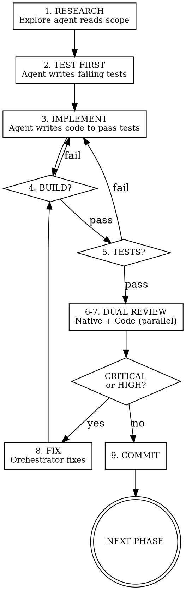

# Agentic Loop Builder

Orchestrate phased implementation using sub-agents for research, testing, coding, and review — with hard gates between phases. The orchestrator delegates, coordinates, and fixes. Sub-agents execute.

## Before Starting

If you don't have clear requirements for the work — what to build, what "done" looks like, what constraints apply — offer to interview the user first:

> "I can start planning, but I'd get better results with more context. Want me to interview you about [the domain] first? I'll ask detailed questions about requirements, edge cases, and tradeoffs, then write a spec we can plan from."

If they say yes, conduct an in-depth interview: dig into technical details, UI/UX considerations, edge cases, security, performance, integration points. Don't accept vague answers. When done, write the spec to a file and use it as input to the phase planning.

If they say no or the requirements are already clear (existing spec, detailed issue, prior conversation context), skip straight to phase planning.

## Core Loop



## Phase Declaration

Before starting any phase, declare:

```
Phase: [name]
Goal: [one sentence]
Build: [exact command]
Test: [exact command]
Native reviewer: [skill or agent type]
Code reviewer: [skill or agent type]
Scope: [files to touch]
```

This prevents scope creep and gives sub-agents clear boundaries.

## Sub-Agent Prompt Contract

Every sub-agent dispatch includes:

1. **Task** — one sentence, what to do
2. **Files** — exact paths to read and/or modify
3. **Context** — protocol specs, type definitions, or reference sections needed
4. **Success criterion** — how the agent knows it's done (build passes, test passes, report generated)
5. **Constraints** — what NOT to touch (files outside phase scope)

Omitting any of these produces bad results. 30 seconds writing a complete prompt saves 5 minutes re-dispatching.

## Steps

### 1. Research

Dispatch an Explore agent to read files in scope and report: what exists, what's broken, what's missing. Always run this even when the code seems familiar — sub-agents start with zero context and will guess at types without it.

### 2. Test First

Dispatch an agent to write failing tests BEFORE implementation. The agent receives research findings, test file locations, and the test framework.

For protocol/networking: test exact wire format, mock expected server responses, cover error cases.
For UI: test state transitions, view hierarchy expectations, accessibility.
For logic: test boundary conditions and the specific bug or feature being addressed.

Tests must fail. If they pass, the behavior already exists (skip implementation) or the tests are wrong.

### 3. Implement

Dispatch an agent to write minimal code making the tests pass. The agent receives: failing test file paths, allowed file scope, any protocol/API reference, and the build command.

The agent runs the build command before returning. If build fails, it fixes until clean.

### 4. Build Gate

Run the build command yourself (don't trust the sub-agent's report alone). If it fails, send the error output back to step 3. Build failures in unrelated files that predate this phase can be noted and skipped if they don't affect the phase scope.

### 5. Test Gate

Run the test command. All tests must pass — both new tests from step 2 and any pre-existing tests. If failures occur, send the output back to step 3.

### 6. Native Review

Dispatch a platform-specialist review agent (read-only). Choose based on domain:

| Domain | Reviewer |
|--------|----------|
| iOS/Swift | `apple-swift-language-expert`, `apple-swiftui-mastery`, `apple-networking-apis` |
| macOS | `apple-macos-ux-full`, `apple-architecture-patterns` |
| Web frontend | `design-maestro`, `nextjs-app-router-patterns` |
| General | `code-reviewer-guardian` |

The reviewer receives: phase goal, diff, spec/protocol reference, and instructions to rate findings by severity.

### 7. Code Review

Dispatch a general code quality reviewer in parallel with step 6. This agent checks correctness, error handling, memory management, thread safety, security. Same severity system. Read-only.

**Severity scale (P0–P3):**
- **P0 Critical** — crashes, security holes, data loss, protocol violations
- **P1 High** — concurrency bugs, retain cycles, architectural boundary breaks, missing error handling
- **P2 Medium** — maintainability, test gaps, style deviations, missing states
- **P3 Low** — naming, minor improvements, polish

### 8. Fix

The orchestrator reads both review reports and fixes P0 and P1 issues. Do not delegate fixes — only the orchestrator has seen both reports and the full phase context. After fixing, loop back to step 4 (build gate).

P2 and P3 findings are noted but do not block the phase.

### 9. Commit

Once build passes, tests pass, and no P0/P1 issues remain: commit with a descriptive message, update task tracking, move to next phase.

## Error Recovery

If a sub-agent fails (context overflow, can't fix build, returns garbage):

1. Read its partial output — it often contains useful diagnostics
2. Reduce scope: split the step into fewer files or a single file at a time
3. Re-dispatch with a more constrained prompt: explicit types, concrete examples, fewer responsibilities
4. After 2 failed dispatches on the same step, do it yourself — debugging the sub-agent now costs more than direct implementation
5. After 3 fix cycles at the same gate, the phase scope is too large — split it

## Parallel vs Sequential

- Steps 1–5 are sequential (each depends on the previous)
- Steps 6–7 run in parallel (independent review perspectives)
- Phases are sequential (each builds on the previous)

## Review Dimensions

Both reviewers should cover relevant dimensions from this list. Not every dimension applies to every phase — pick what's relevant.

**Code dimensions:**

| Dimension | What to check |
|-----------|---------------|
| Correctness | Logic errors, protocol mismatches, wrong behavior |
| Security | Credential handling, injection, auth bypass |
| Concurrency | Data races, actor isolation, Sendable compliance |
| Performance | N+1 queries, unnecessary allocations, blocking main thread |
| Error handling | Missing catches, silent failures, crash paths |
| Platform idioms | Native patterns vs fighting the framework |

**UI/Design dimensions** (when phase touches views or styling):

| Dimension | What to check |
|-----------|---------------|
| Visual hierarchy | Focal points, information flow, heading/body/meta distinction |
| Interaction states | Default, hover, active, focus, disabled all present |
| Accessibility | VoiceOver labels, touch targets (44pt min), WCAG AA contrast, dynamic type |
| Responsiveness | Phone/tablet layouts, safe areas, keyboard handling |
| Loading/empty/error | Every async view has all three states, not just the happy path |
| Design token usage | Colors from theme, not hardcoded hex; spacing from scale, not magic numbers |

## Red Flags — Stop

- Skipping tests because "this is just a config change"
- Skipping native review because "it's just networking"
- Fixing P2 issues before moving on (scope creep)
- Sub-agent says "build succeeded" without showing output (verify yourself)
- Review agent making changes instead of reporting (reviewers are read-only)
- More than 3 fix cycles on the same phase (scope is too large — split it)
- Orchestrator writing code instead of delegating (you coordinate, sub-agents execute)

## Adapting to Your Project

| Parameter | iOS | Web | Python |
|-----------|-----|-----|--------|
| Build | `xcodebuild ... build` | `npm run build` | `python -m py_compile` |
| Test | `xcodebuild ... test` | `npm test` | `pytest` |
| Native reviewer | `apple-swift-language-expert` | `design-maestro` | — |
| Code reviewer | `code-reviewer-guardian` | `code-reviewer-guardian` | `code-reviewer-guardian` |
