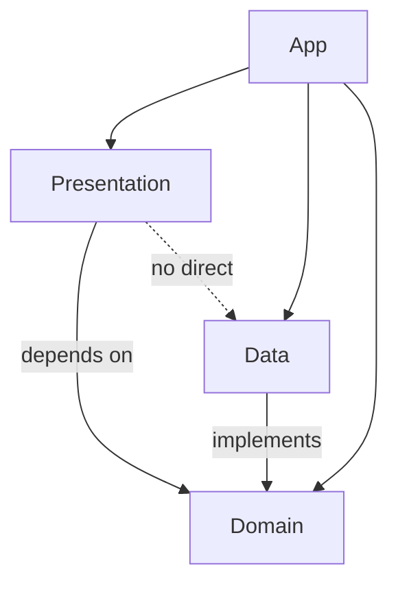
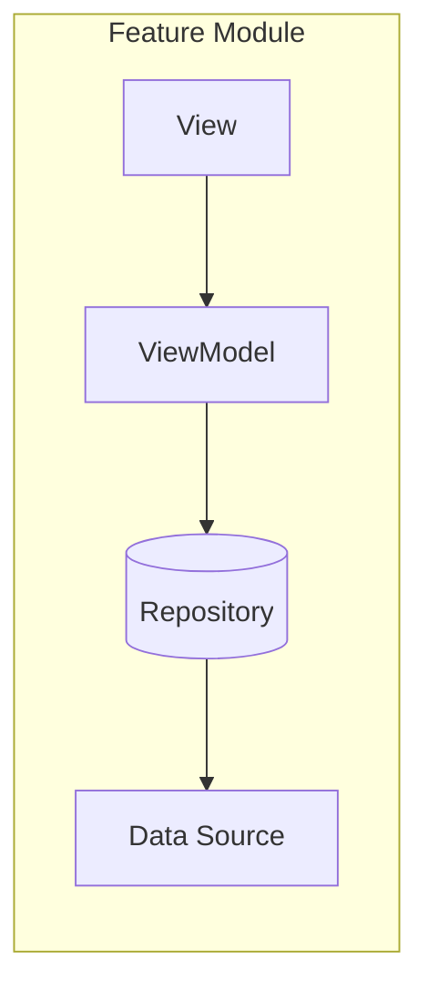

# Project Structure Diagrams

```mermaid
graph TD
    A[App] --> P[Presentation]
    A --> D[Data]
    A --> U[Domain]
    P -->|depends on| U
    D -->|implements| U
    P -.->|no direct| D
```

```mermaid
flowchart LR
    subgraph Feature Module
        V[View] --> VM[ViewModel]
        VM --> Repo[(Repository)]
        Repo --> DS[Data Source]
    end
```
