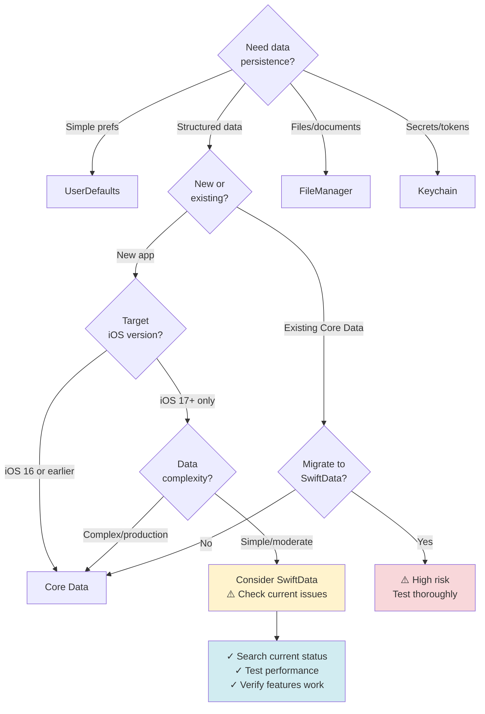

# Apple Data Persistence (2025 Edition)

Batteries-included skill for Apple-platform data layers: SwiftData, Core Data, CloudKit, UserDefaults, FileManager, and Keychain — with migrations, offline-first sync patterns, schema generators, and production-ready best practices.

**⚠️ CRITICAL: SwiftData evolves rapidly. Core Data is mature but still largely unchanged since iOS 18, while SwiftData has seen incremental fixes in iOS 19 (model inheritance and persistent history). Always verify current capabilities before committing to a persistence strategy.**

---

## Quick Reference - When to Use Each Tool



**Decision Matrix (October 2025):**

| Factor | SwiftData | Core Data |
|--------|-----------|-----------|
| **iOS Version** | 17+ only | All versions |
| **Maturity** | ⚠️ Rapidly evolving, breaking changes in iOS 18 | ✅ Mature, stable |
| **Performance** | ⚠️ 2x memory vs Core Data (iOS 18) | ✅ Optimized |
| **CloudKit Sync** | ⚠️ Private DB only, reliability issues | ✅ NSPersistentCloudKitContainer proven |
| **Migration Tools** | ⚠️ Limited, no heavyweight | ✅ Full lightweight + heavyweight |
| **Documentation** | ⚠️ Sparse, community-driven | ✅ Extensive, 15+ years |
| **Learning Curve** | ✅ SwiftUI-native, cleaner API | ⚠️ Steeper, Objective-C heritage |
| **Production Ready** | ⚠️ "Becoming viable" — **iOS 19** adds model inheritance & persistent history, but many limitations remain; always check the latest release notes before shipping | ✅ Battle‑tested at scale |

**Recommendation (October 2025):**

- **New simple apps (iOS 17+)**: Consider SwiftData, but **search for current issues** first and check iOS 19 release notes for fixes (model inheritance and persistent history).
- **Production apps**: Core Data (proven, reliable, mature) until SwiftData stabilizes beyond iOS 19.
- **Complex data models**: Core Data (more features, better performance; SwiftData lacks batch operations and advanced migrations).
- **Need iOS 16 support**: Core Data (SwiftData requires iOS 17+).
- **CloudKit sync**: Core Data (NSPersistentCloudKitContainer is more reliable; SwiftData only supports the private database).

---

## ⚠️ Version Awareness & Search Requirements

### SwiftData - Rapidly Evolving (iOS 17+)

**SwiftData is NEW (introduced iOS 17) and changes significantly with each iOS release.**

**BEFORE using SwiftData, Claude MUST search:**

```python
# Required searches before SwiftData implementation
queries = [
    "SwiftData iOS 18 known issues 2025",
    "SwiftData performance problems iOS 18",
    "SwiftData vs Core Data 2025",
    "SwiftData migration issues iOS 18",
    "SwiftData {specific_feature} bugs"  # e.g., @ModelActor, #Index, relationships
]
```

**When to search:**
- User mentions iOS version newer than last verified (Oct 2025)
- "SwiftData not working", "migration failing", "crashes"
- "Should I use SwiftData or Core Data for {use case}"
- Performance concerns ("SwiftData slow", "memory issues")
- Before recommending SwiftData for production apps

**iOS 17 → iOS 18/19 Breaking Changes:**
- Major underlying refactoring (moved away from Core Data coupling)
- Many iOS 17 apps broke in iOS 18
- Performance degraded for some use cases
- View updates under `@ModelActor` broken (fixed in iOS 26 beta)
- 30-second delays reported for simple inserts

**iOS 18 New Features:**
- `#Index` macro for performance (⚠️ does NOT back-deploy to iOS 17)
- `#Unique` macro for compound uniqueness constraints
- `#Expression` macro for complex predicates
- Custom data stores
- SwiftData history API
- Queries in Xcode previews


**iOS 19 Improvements:**

- **Model inheritance support** – SwiftData now supports simple class inheritance for `@Model` types (e.g., `class Employee: Person { … }`). This enables code reuse and improved schema evolution but still lacks support for deep inheritance chains【779207448288905†L23-L29】.
- **Persistent history & merge helpers** – iOS 19 adds a history API similar to Core Data’s persistent history. You can now fetch and merge history transactions, easing multi‑device sync and conflict resolution【779207448288905†L23-L29】.

These improvements are **incremental**; many limitations listed below still apply. Read the latest release notes before using them.

**Known Limitations (verify current):**
- ⚠️ Memory usage 2x higher than Core Data
- ⚠️ Slower read/write performance than Core Data
- ⚠️ CloudKit sync: private database only, no shared/public
- ⚠️ Incomplete predicate support
- ⚠️ No batch operations (use Core Data for this)
- ⚠️ Limited migration tools (no heavyweight migrations)
- ⚠️ Optional properties required for CloudKit sync
- ⚠️ Cannot assign relationships in model initializers
- ⚠️ SortDescriptor crashes with optional relationships

**Good practices (current):**
- Use `@ModelActor` for concurrent operations
- Mark large data as external storage: `@Attribute(.externalStorage)`
- Never assign relationships in initializers
- Use `FetchDescriptor` with limits for performance
- Test on physical devices (simulators hide performance issues)
- Enable persistent history tracking
- Subscribe to Apple Developer Forums for bug updates

---

### Core Data - Mature but Stagnant

**Core Data received ZERO updates at WWDC24.** It's mature but Apple's focus is on SwiftData.

**When to search Core Data info:**
- CloudKit sync issues: "NSPersistentCloudKitContainer iOS 18 bugs"
- Migration problems: "Core Data migration iOS 18"
- Swift 6 compatibility: "Core Data Swift 6 concurrency"
- iOS 18 specific: "Core Data iOS 18 breaking changes"

**iOS 18 Known Issues:**
- ⚠️ NSPersistentCloudKitContainer sync delays/failures reported
- ⚠️ Data deletion when users disable iCloud (new behavior)
- ⚠️ Changed persistent history tracking behavior
- ⚠️ Recommendation: Switch between `NSPersistentContainer` and `NSPersistentCloudKitContainer` based on iCloud status

**Core Data + iOS 18 Best Practices:**
```swift
// NEW iOS 18 pattern: switch container based on iCloud status
func initCoreDataStack() {
    if usesiCloud {
        pc = NSPersistentCloudKitContainer(name: "YourModel")
    } else {
        pc = NSPersistentContainer(name: "YourModel")
    }
    
    guard let description = pc.persistentStoreDescriptions.first else {
        fatalError("No store description")
    }
    
    // ALWAYS enable persistent history (even without CloudKit)
    description.setOption(true as NSNumber, forKey: NSPersistentHistoryTrackingKey)
    description.setOption(true as NSNumber, 
                         forKey: NSPersistentStoreRemoteChangeNotificationPostOptionKey)
    
    if usesiCloud {
        let options = NSPersistentCloudKitContainerOptions(
            containerIdentifier: "iCloud.your.container"
        )
        description.cloudKitContainerOptions = options
    }
    
    pc.viewContext.automaticallyMergesChangesFromParent = true
    pc.viewContext.mergePolicy = NSMergeByPropertyObjectTrumpMergePolicy
    
    pc.loadPersistentStores { description, error in
        if let error = error {
            // Handle error
        }
    }
}
```

---

### CloudKit Sync - Complex & Opaque

**CloudKit sync is NOT real-time.** Timing is opportunistic based on system conditions.

**When to search CloudKit info:**
- Sync reliability: "CloudKit sync reliability 2025"
- Conflicts: "CloudKit conflict resolution best practices"
- Performance: "CloudKit sync performance optimization"
- Debugging: "CloudKit sync not working iOS 18"

**Critical CloudKit Facts:**
- Sync operates on "opportunistic" basis (no guaranteed timing)
- Minimum 30-second intervals between rapid operations (throttling)
- Foreground apps get highest priority for sync
- File coordination required for iCloud Drive (NSFileCoordinator)
- Schema changes in production are PERMANENT
- Private/public/shared databases have different behaviors

**CloudKit + SwiftData vs CloudKit + Core Data:**
- SwiftData: Only private database, less mature, more issues
- Core Data: Full support (private/shared/public), battle-tested

**Recommendation:** For production CloudKit sync, use Core Data with NSPersistentCloudKitContainer.

---

## Included Utilities

### Schema Generation Scripts

```bash
# 1) Generate SwiftData @Model classes from schema.json
python3 scripts/generate_swiftdata_models.py --schema schema.json --out swift/SwiftDataExample/Models.swift

# 2) Generate Core Data NSManagedObject subclasses + in-code NSManagedObjectModel
python3 scripts/generate_coredata_model_code.py --schema schema.json --out swift/CoreDataExample/ModelBuilder.swift

# 3) Diff two schemas and emit SwiftData VersionedSchema + SchemaMigrationPlan skeleton
python3 scripts/diff_migration_plan_swiftdata.py --old old_schema.json --new new_schema.json --out swift/SwiftDataExample/MigrationPlan.swift

# 4) Visualize schema as Mermaid ER diagram
python3 scripts/schema_to_mermaid.py --schema schema.json --out docs/schema.mmd
```

**Schema Format (JSON):**
```json
{
  "models": [
    {
      "name": "Project",
      "attributes": [
        {"name": "id", "type": "UUID", "unique": true},
        {"name": "name", "type": "String"},
        {"name": "createdAt", "type": "Date", "default": "now"}
      ],
      "relationships": [
        {
          "name": "tasks",
          "destination": "Task",
          "toMany": true,
          "deleteRule": "cascade",
          "inverse": "project"
        }
      ]
    }
  ]
}
```

---

## SwiftData Current State (iOS 17-18)

### What's Working Well (October 2025)

Based on community reports and official documentation:

**Stable features:**
- Basic CRUD operations with `@Model` and `ModelContext`
- `@Query` property wrapper for SwiftUI integration
- Lightweight migrations (adding/removing simple properties)
- `@Attribute(.unique)` for single-property uniqueness
- Relationships (to-one and to-many)
- External storage for large binaries
- Xcode preview support

**iOS 18 improvements:**
- `#Index` for query performance (iOS 18+, no back-deploy)
- `#Unique` for compound constraints (iOS 18+)
- Custom data stores
- Better predicate support with `#Expression`

### Known Issues (Verify Before Using)

**Performance:**
- 2x memory usage vs Core Data (reported iOS 18)
- Slower queries than Core Data (especially complex relationships)
- 30-second delays for simple inserts reported by some users
- Performance degradation in iOS 18 for some use cases

**CloudKit Sync:**
- Private database only (no shared/public)
- Sync reliability issues reported
- Must use optional properties for CloudKit-synced models
- Duplicate records without proper unique constraints

**Relationships:**
- Cannot assign relationships in model initializers
- SortDescriptor crashes with optional relationships
- Inverse relationships can be fragile

**Threading:**
- `@ModelActor` view updates broken in iOS 18 (fixed iOS 26 beta)
- Thread safety issues if not using `@ModelActor`
- `EXC_BAD_ACCESS` when accessing models from wrong thread

**Migrations:**
- No heavyweight migrations (custom mapping)
- Limited migration tooling vs Core Data
- Breaking changes in iOS 18 for iOS 17 code

**Testing:**
- Hard to unit test (UI tests recommended)
- No easy way to verify database state in tests

### When to Choose SwiftData vs Core Data

**Use SwiftData IF:**
- ✅ New app targeting iOS 17+  only
- ✅ Simple to moderate data models (< 10 entities, shallow relationships)
- ✅ SwiftUI-first architecture
- ✅ You've searched for and reviewed current issues
- ✅ You've tested performance on physical devices
- ✅ You're prepared for potential breaking changes in future iOS updates
- ⚠️ You accept 2x memory overhead vs Core Data
- ⚠️ You accept slower performance vs Core Data

**Use Core Data IF:**
- ✅ Production app where stability is critical
- ✅ Complex data models (many entities, deep relationships)
- ✅ Need iOS 16 or earlier support
- ✅ CloudKit sync is required (more reliable with Core Data)
- ✅ Need batch operations
- ✅ Need heavyweight migrations
- ✅ Need proven, battle-tested persistence
- ✅ Team has Core Data expertise

**Hybrid Approach:**
- Some projects use both (SwiftData for new simple features, Core Data for complex)
- Requires careful coordination (both use same SQLite format)

---

## Migration Strategies (Current Best Practices)

### Core Data → SwiftData Migration

**⚠️ HIGH RISK. Test exhaustively. Have rollback plan.**

**Before migrating:**
1. Verify target iOS version supports needed SwiftData features
2. Search for current migration success stories
3. Test on production-sized datasets
4. Create rollback plan
5. Consider feature flags for gradual rollout

**Current migration process (iOS 18):**

1. **Generate SwiftData models from Core Data:**
   - In Xcode: Editor → Create SwiftData Code (from .xcdatamodeld)
   - Review generated code carefully
   - Add iOS 17+ availability checks

2. **Set up coexistence (if incremental):**
   ```swift
   // Namespace to avoid collisions
   enum CoreDataModels {
       // Keep NSManagedObject subclasses here
   }
   
   // SwiftData models
   @Model class Task { ... }
   ```

3. **Migration options:**
   - **Option A:** Full switch (high risk, one-time migration)
   - **Option B:** Gradual (new features in SwiftData, legacy in Core Data)
   - **Option C:** Abort and stay with Core Data (often the safest)

**Known migration gotchas:**
- Relationships require careful handling
- CloudKit sync may need reset
- Performance may degrade (test!)
- Breaking changes in future iOS versions

**Recommendation:** For most production apps, **do NOT migrate** from Core Data to SwiftData in 2025. Wait for iOS 26+ when SwiftData stabilizes further.

### SwiftData Schema Migrations

**iOS 17 vs iOS 18 differences:**
- iOS 18 has better migration support but still limited
- Always use `VersionedSchema` from day one

**Migration pattern:**
```swift
// ALWAYS version from day one
enum SchemaV1: VersionedSchema {
    static var versionIdentifier = Schema.Version(1, 0, 0)
    static var models: [any PersistentModel.Type] {
        [Task.self, Project.self]
    }
    
    @Model class Task {
        var title: String
        var isDone: Bool
        // ... properties
    }
}

// When schema changes
enum SchemaV2: VersionedSchema {
    static var versionIdentifier = Schema.Version(2, 0, 0)
    static var models: [any PersistentModel.Type] {
        [Task.self, Project.self]
    }
    
    @Model class Task {
        var title: String
        @Attribute(originalName: "isDone") var isCompleted: Bool  // Renamed
        var priority: Int = 0  // Added
        // ...
    }
}

// Migration plan
enum TaskMigrationPlan: SchemaMigrationPlan {
    static var schemas: [any VersionedSchema.Type] {
        [SchemaV1.self, SchemaV2.self]  // ORDER MATTERS
    }
    
    static var stages: [MigrationStage] {
        [migrateV1toV2]
    }
    
    static let migrateV1toV2 = MigrationStage.custom(
        fromVersion: SchemaV1.self,
        toVersion: SchemaV2.self,
        willMigrate: { context in
            // Optional: pre-migration logic
        },
        didMigrate: { context in
            // Optional: post-migration logic
        }
    )
}
```

**Lightweight migrations (automatic):**
- Adding/removing properties
- Renaming (with `@Attribute(originalName:)`)
- Changing relationship type
- Adding indexes (iOS 18+)

**Custom migrations (manual):**
- De-duplicating data
- Complex data transformations
- Splitting/merging entities

### Core Data Schema Migrations

**Lightweight (automatic):**
```swift
let description = NSPersistentStoreDescription()
description.setOption(true as NSNumber, forKey: NSMigratePersistentStoresAutomaticallyOption)
description.setOption(true as NSNumber, forKey: NSInferMappingModelAutomaticallyOption)
```

**Heavyweight (custom mapping model):**
- Use Xcode's Core Data Model Editor
- Create mapping model
- Implement `NSEntityMigrationPolicy` subclass for custom logic

### CloudKit Schema Migrations

**⚠️ CloudKit schema changes are PERMANENT in production.**

**Before updating CloudKit schema:**
1. Test in development environment
2. Verify all devices can handle old + new schema
3. Use `.dryRun` option to preview changes
4. Consider versioning your records
5. Have rollback plan (may require new app version)

```swift
// Preview schema changes
try? container.initializeCloudKitSchema(options: .dryRun)

// Apply schema changes
try? container.initializeCloudKitSchema(options: .printSchema)
```

---

## CloudKit Sync Troubleshooting

### Common Issues & Solutions (October 2025)

**Issue: Sync Not Starting**

Checklist:
1. Verify iCloud account signed in: `CKContainer.default().accountStatus`
2. Check CloudKit capability enabled in Xcode
3. Verify container identifier matches entitlements
4. Check network connectivity
5. Verify CloudKit dashboard shows container
6. Enable CloudKit logging: `-com.apple.CoreData.CloudKitDebug 1`

**Issue: Conflicts Not Resolving**

Core Data approach:
```swift
// Set merge policy
context.mergePolicy = NSMergeByPropertyObjectTrumpMergePolicy  // Last write wins

// Or custom merge policy
context.mergePolicy = NSMergePolicy(merge: .mergeByPropertyObjectTrumpMergePolicyType)

// For fine-grained control, implement custom NSMergePolicy subclass
```

CloudKit raw API approach:
```swift
let modifyOp = CKModifyRecordsOperation(...)
modifyOp.savePolicy = .ifServerRecordUnchanged
modifyOp.modifyRecordsResultBlock = { result in
    switch result {
    case .success:
        // Success
    case .failure(let error):
        if let ckError = error as? CKError,
           ckError.code == .serverRecordChanged {
            // Handle conflict
            let serverRecord = ckError.serverRecord
            // Merge logic here
        }
    }
}
```

**Issue: Sync Performance Slow**

Solutions:
1. Use custom zones (not default zone)
2. Implement change token tracking
3. Use `CKFetchRecordZoneChangesOperation` for delta sync
4. Batch operations (max 400 records per operation)
5. Use `CKSyncEngine` (iOS 17+) for automatic optimization
6. Coalesce rapid changes (don't spam server with tiny updates)
7. Remember: CloudKit is NOT real-time (30-second minimum intervals)

**Issue: "Syncing with iCloud Paused"**

Common causes:
- Low battery (iOS conserves power)
- No Wi-Fi (iOS may wait for Wi-Fi)
- iCloud storage full
- App backgrounded (low priority)
- User disabled iCloud for app

Solution: Educate users, provide manual sync button, design for offline-first

**Issue: Data Deleted When iCloud Disabled**

**NEW iOS 18 behavior:**
- `NSPersistentCloudKitContainer` may delete data when user disables iCloud
- Use separate containers:

```swift
// Switch based on iCloud status
if isICloudAvailable() {
    container = NSPersistentCloudKitContainer(name: "Model")
} else {
    container = NSPersistentContainer(name: "Model")
    // Enable history tracking even without CloudKit
    description.setOption(true as NSNumber, forKey: NSPersistentHistoryTrackingKey)
}
```

---

## Performance Optimization

### SwiftData Performance Tips

**Query optimization:**
```swift
// ❌ Bad: Loads all data
@Query var tasks: [Task]

// ✅ Good: Filter in predicate
@Query(filter: #Predicate<Task> { $0.isCompleted == false })
var incompleteTasks: [Task]

// ✅ Good: Use FetchDescriptor with limits
let descriptor = FetchDescriptor<Task>(
    predicate: #Predicate { $0.priority > 5 },
    sortBy: [SortDescriptor(\.dueDate)],
    fetchLimit: 20
)
let topTasks = try context.fetch(descriptor)

// ✅ Good: Prefetch relationships
var descriptor = FetchDescriptor<Project>()
descriptor.relationshipKeyPathsForPrefetching = [\.tasks]
let projects = try context.fetch(descriptor)
```

**Large data handling:**
```swift
// Mark large data for external storage
@Model class Photo {
    @Attribute(.externalStorage) var imageData: Data
    // SwiftData loads this only when accessed
}
```

**Background operations:**
```swift
// Use ModelActor for background work
@ModelActor
actor DataProcessor {
    func processLargeDataset() async {
        // Heavy work here, off main thread
        let items = try? modelContext.fetch(FetchDescriptor<Item>())
        // Process items...
    }
}
```

### Core Data Performance Tips

**Batch operations (not available in SwiftData):**
```swift
// Batch update
let batchUpdate = NSBatchUpdateRequest(entityName: "Task")
batchUpdate.propertiesToUpdate = ["isArchived": true]
batchUpdate.predicate = NSPredicate(format: "completed == YES")
try context.execute(batchUpdate)

// Batch delete
let fetchRequest = NSFetchRequest<NSFetchRequestResult>(entityName: "Task")
let batchDelete = NSBatchDeleteRequest(fetchRequest: fetchRequest)
try context.execute(batchDelete)
```

**Faulting & prefetching:**
```swift
let fetchRequest = NSFetchRequest<Project>(entityName: "Project")
fetchRequest.relationshipKeyPathsForPrefetching = ["tasks", "tasks.assignee"]
let projects = try context.fetch(fetchRequest)
```

**Indexing:**
```xcdatamodeld
// In Core Data model editor:
- Select entity attribute
- Check "Indexed" in Data Model Inspector
```

### CloudKit Performance

**Batch operations:**
```swift
// Batch save (max 400 records)
let modifyOp = CKModifyRecordsOperation(
    recordsToSave: records,  // Array of CKRecord
    recordIDsToDelete: nil
)
database.add(modifyOp)
```

**Change tracking:**
```swift
// Use server change tokens for delta sync
let fetchZoneChanges = CKFetchRecordZoneChangesOperation(
    recordZoneIDs: [zoneID],
    configurationsByRecordZoneID: [
        zoneID: CKFetchRecordZoneChangesOperation.ZoneConfiguration(
            previousServerChangeToken: savedToken,
            resultsLimit: 100
        )
    ]
)
```

---

## Offline-First Architecture

### Pattern: Core Data + NSPersistentCloudKitContainer

**Recommended for production apps:**

```swift
// Setup
class PersistenceController {
    static let shared = PersistenceController()
    let container: NSPersistentCloudKitContainer
    
    init() {
        container = NSPersistentCloudKitContainer(name: "Model")
        
        guard let description = container.persistentStoreDescriptions.first else {
            fatalError("No store description")
        }
        
        // Enable history tracking
        description.setOption(true as NSNumber, forKey: NSPersistentHistoryTrackingKey)
        description.setOption(true as NSNumber, 
                             forKey: NSPersistentStoreRemoteChangeNotificationPostOptionKey)
        
        // CloudKit options
        let cloudKitOptions = NSPersistentCloudKitContainerOptions(
            containerIdentifier: "iCloud.com.yourapp.container"
        )
        description.cloudKitContainerOptions = cloudKitOptions
        
        container.loadPersistentStores { description, error in
            if let error = error {
                fatalError("Core Data failed to load: \(error.localizedDescription)")
            }
        }
        
        container.viewContext.automaticallyMergesChangesFromParent = true
        container.viewContext.mergePolicy = NSMergeByPropertyObjectTrumpMergePolicy
    }
}
```

**Architecture:**
- ✅ Local source of truth (Core Data)
- ✅ UI reads/writes locally (instant response)
- ✅ Automatic background sync to CloudKit
- ✅ Persistent history for change tracking
- ✅ Conflict resolution (merge policy)

**Observing changes:**
```swift
// Watch for remote changes
NotificationCenter.default.addObserver(
    self,
    selector: #selector(handleRemoteChange),
    name: .NSPersistentStoreRemoteChange,
    object: nil
)

@objc func handleRemoteChange(_ notification: Notification) {
    // Refresh UI or handle conflicts
}
```

---

## Security Best Practices

### Keychain

**Current best practices (iOS 18):**

```swift
// Store token securely
func saveToken(_ token: String, for key: String) {
    let data = token.data(using: .utf8)!
    
    let query: [String: Any] = [
        kSecClass as String: kSecClassGenericPassword,
        kSecAttrAccount as String: key,
        kSecValueData as String: data,
        kSecAttrAccessible as String: kSecAttrAccessibleAfterFirstUnlock,  // or ThisDeviceOnly
        kSecAttrSynchronizable as String: false  // Don't sync via iCloud Keychain (usually)
    ]
    
    // Delete old value if exists
    SecItemDelete(query as CFDictionary)
    
    // Add new value
    let status = SecItemAdd(query as CFDictionary, nil)
    guard status == errSecSuccess else {
        print("Failed to save to keychain: \(status)")
        return
    }
}

// Retrieve token
func retrieveToken(for key: String) -> String? {
    let query: [String: Any] = [
        kSecClass as String: kSecClassGenericPassword,
        kSecAttrAccount as String: key,
        kSecReturnData as String: true,
        kSecMatchLimit as String: kSecMatchLimitOne
    ]
    
    var result: AnyObject?
    let status = SecItemCopyMatching(query as CFDictionary, &result)
    
    guard status == errSecSuccess,
          let data = result as? Data,
          let token = String(data: data, encoding: .utf8) else {
        return nil
    }
    
    return token
}
```

**Access levels:**
- `kSecAttrAccessibleWhenUnlocked` - Most secure, requires device unlock
- `kSecAttrAccessibleAfterFirstUnlock` - Available after first unlock (recommended for most)
- `kSecAttrAccessibleWhenUnlockedThisDeviceOnly` - Don't sync via iCloud
- `kSecAttrAccessibleAfterFirstUnlockThisDeviceOnly` - Combination

**Access groups (for sharing between apps):**
```swift
query[kSecAttrAccessGroup as String] = "TEAM_ID.com.yourcompany.shared"
```

### Core Data Encryption

**Encrypted SQLite store:**
```swift
let description = NSPersistentStoreDescription()
description.setOption(FileProtectionType.complete as NSObject, 
                      forKey: NSPersistentStoreFileProtectionKey)
```

**Sensitive data:**
- Don't store in Core Data if possible
- Use Keychain for credentials/tokens
- Implement custom `NSValueTransformer` for encrypted properties

### Data Protection

**FileManager attributes:**
```swift
// Exclude from backup
var url = fileURL
var resourceValues = URLResourceValues()
resourceValues.isExcludedFromBackup = true
try? url.setResourceValues(resourceValues)

// Set file protection
try? FileManager.default.setAttributes(
    [FileAttributeKey.protectionKey: FileProtectionType.complete],
    ofItemAtPath: url.path
)
```

---

## Testing Strategies

### SwiftData Testing

**Challenges:**
- Hard to unit test (mainly UI tests)
- Can't easily verify database state
- Requires physical devices for real performance testing

**Approaches:**
1. **In-memory testing:**
```swift
let config = ModelConfiguration(isStoredInMemoryOnly: true)
let container = try ModelContainer(for: Task.self, configurations: config)
let context = container.mainContext
// Test operations...
```

2. **MVVM/Service layer:**
```swift
// Make testable by abstracting SwiftData
protocol TaskRepository {
    func fetchTasks() async throws -> [Task]
    func save(_ task: Task) async throws
}

class SwiftDataTaskRepository: TaskRepository {
    let modelContext: ModelContext
    // Implement methods...
}

// Test with mock
class MockTaskRepository: TaskRepository {
    // Easy to test
}
```

### Core Data Testing

**Unit tests:**
```swift
class CoreDataTests: XCTestCase {
    var container: NSPersistentContainer!
    var context: NSManagedObjectContext!
    
    override func setUp() {
        super.setUp()
        container = NSPersistentContainer(name: "Model")
        let description = NSPersistentStoreDescription()
        description.type = NSInMemoryStoreType
        container.persistentStoreDescriptions = [description]
        
        container.loadPersistentStores { description, error in
            XCTAssertNil(error)
        }
        
        context = container.viewContext
    }
    
    func testTaskCreation() {
        let task = Task(context: context)
        task.title = "Test"
        
        try? context.save()
        
        let fetchRequest: NSFetchRequest<Task> = Task.fetchRequest()
        let results = try? context.fetch(fetchRequest)
        
        XCTAssertEqual(results?.count, 1)
        XCTAssertEqual(results?.first?.title, "Test")
    }
}
```

### Migration Testing

**SwiftData migration tests:**
```swift
func testMigrationV1toV2() throws {
    // 1. Create V1 container and seed data
    let v1Container = try ModelContainer(
        for: SchemaV1.Task.self,
        configurations: ModelConfiguration(isStoredInMemoryOnly: false)
    )
    let v1Context = v1Container.mainContext
    // Add V1 data...
    try v1Context.save()
    
    // 2. Create V2 container (triggers migration)
    let v2Container = try ModelContainer(
        for: SchemaV2.Task.self,
        migrationPlan: TaskMigrationPlan.self,
        configurations: ModelConfiguration(url: storeURL)
    )
    let v2Context = v2Container.mainContext
    
    // 3. Verify migrated data
    let fetchedTasks = try v2Context.fetch(FetchDescriptor<SchemaV2.Task>())
    XCTAssertEqual(fetchedTasks.count, expectedCount)
    // Verify properties migrated correctly...
}
```

---

## Debugging & Monitoring

### SwiftData Debugging

**Enable logging:**
```bash
# SQLite debug
-com.apple.CoreData.SQLDebug 1

# CloudKit debug
-com.apple.CoreData.CloudKitDebug 1
```

**Common errors:**
- `EXC_BAD_ACCESS` - Accessing model from wrong thread (use `@ModelActor`)
- "Model not in context" - Model deleted or context disposed
- "Relationship cannot be nil" - Assigned relationship in initializer
- Slow performance - Profile with Instruments

**Instruments templates:**
- Core Data (also works for SwiftData)
- Time Profiler
- Allocations
- Leaks

### Core Data Debugging

**SQL logging:**
```bash
-com.apple.CoreData.SQLDebug 1  # Basic
-com.apple.CoreData.SQLDebug 3  # Verbose
```

**CloudKit debugging:**
```bash
-com.apple.CoreData.CloudKitDebug 1
```

**Persistent history:**
```swift
// Query history
let historyRequest = NSPersistentHistoryChangeRequest.fetchHistory(after: lastToken)
let historyResult = try context.execute(historyRequest) as? NSPersistentHistoryResult
let transactions = historyResult?.result as? [NSPersistentHistoryTransaction]
```

### CloudKit Dashboard

**Production monitoring:**
- Access: developer.apple.com → CloudKit Dashboard
- Monitor: Telemetry tab for performance metrics
- View: Schema, records, users
- Test: Development vs Production environments

**Key metrics:**
- Request rate
- Error rate
- Data transfer
- Storage usage

---

## Production Checklist

**Before shipping:**

SwiftData apps:
- [ ] Searched for current iOS version issues
- [ ] Tested on physical devices (multiple models)
- [ ] Measured memory usage (compare to Core Data if possible)
- [ ] Tested migrations on production-sized datasets
- [ ] Verified CloudKit sync works reliably
- [ ] Implemented error handling for all operations
- [ ] Added logging for debugging production issues
- [ ] Versioned schema from day one
- [ ] Tested offline-first behavior
- [ ] Performance tested with Instruments
- [ ] Documented known limitations for team

Core Data apps:
- [ ] Tested migrations (lightweight and heavyweight if applicable)
- [ ] Enabled persistent history tracking
- [ ] Configured merge policies
- [ ] Tested CloudKit sync extensively
- [ ] Implemented persistent history change tracking
- [ ] Tested iOS 18 specific behavior changes
- [ ] Added proper error handling
- [ ] Performance tested with Instruments
- [ ] Documented threading model
- [ ] Tested with iCloud enabled/disabled

CloudKit sync:
- [ ] Tested with poor network conditions
- [ ] Tested with multiple devices
- [ ] Implemented conflict resolution
- [ ] Tested schema migrations
- [ ] Set up monitoring in CloudKit Dashboard
- [ ] Implemented manual sync trigger
- [ ] Educated users about sync timing
- [ ] Tested with iCloud storage full scenario
- [ ] Handled account changes gracefully

---

## Resources

### Documentation

**Official:**
- SwiftData: developer.apple.com/documentation/swiftdata
- Core Data: developer.apple.com/documentation/coredata
- CloudKit: developer.apple.com/documentation/cloudkit
- NSPersistentCloudKitContainer: developer.apple.com/documentation/coredata/nspersistentcloudkitcontainer

**WWDC Sessions:**
- WWDC24: "What's new in SwiftData"
- WWDC24: "Create a custom data store with SwiftData"
- WWDC23: "Meet SwiftData"
- WWDC23: "Model your schema with SwiftData"
- WWDC23: "Migrate to SwiftData"
- WWDC23: "Sync to iCloud with CKSyncEngine"

### Community Resources

**Forums:**
- Apple Developer Forums (SwiftData tag) - Most current bug reports
- Swift Forums (SwiftData category)
- Reddit: r/iOSProgramming
- Stack Overflow

**Key Blogs:**
- fatbobman.com (excellent SwiftData/Core Data analysis)
- mjtsai.com (curated developer discussions)
- useyourloaf.com
- hackingwithswift.com

**When to search:**
- Before choosing persistence strategy
- When encountering bugs
- Before major migrations
- For performance optimization
- When planning CloudKit integration

---

## What's Included in This Skill

- `SKILL.md` - This file
- `swift/SwiftDataExample/` - SwiftData models, migration plans, helpers
- `swift/CoreDataExample/` - Core Data stack, CloudKit mirroring, history tracking
- `scripts/` - Schema generators, migration diff tools, visualizers
- `docs/MIGRATIONS.md` - Detailed migration guide
- `docs/PERFORMANCE.md` - Performance optimization deep-dive
- `docs/THREADING.md` - Concurrency patterns
- `docs/BACKUP_RESTORE.md` - Backup/restore implementation
- `docs/PITFALLS_DEBUGGING.md` - Common issues and solutions
- `schema.json` - Example schema definition

---

## Summary of Key Changes (iOS 17 → iOS 18)

**SwiftData:**
- ✅ Added: `#Index`, `#Unique`, `#Expression`, custom data stores
- ⚠️ Breaking: Major refactoring broke many iOS 17 apps
- ⚠️ Performance: 2x memory usage reported vs Core Data
- ⚠️ Bugs: @ModelActor view updates broken (fixed iOS 26)

**Core Data:**
- ⚠️ ZERO new features at WWDC24
- ⚠️ iOS 18: NSPersistentCloudKitContainer sync issues
- ⚠️ iOS 18: Data deletion when iCloud disabled (new behavior)
- ℹ️ Recommendation: Switch containers based on iCloud status

**CloudKit:**
- ℹ️ No major API changes
- ℹ️ CKSyncEngine still recommended for custom sync
- ⚠️ Sync reliability issues persist

**Recommendation:** For new production apps in October 2025, **use Core Data** unless you have specific reasons to use SwiftData and have thoroughly tested it for your use case. SwiftData is "becoming viable" (iOS 26) but not yet proven at scale.

---

**Last Updated:** October 28, 2025
**Next Review:** January 2026 (post-iOS 18.3 release)

**When in doubt:** Search for current state, test thoroughly, choose Core Data for production.
