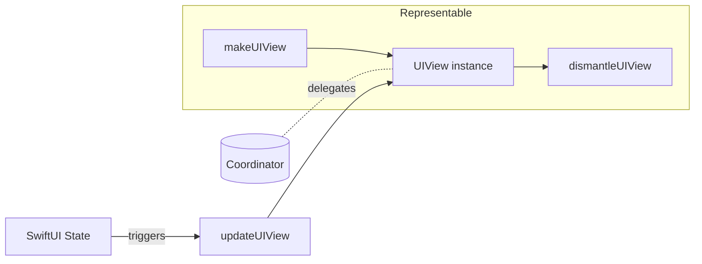
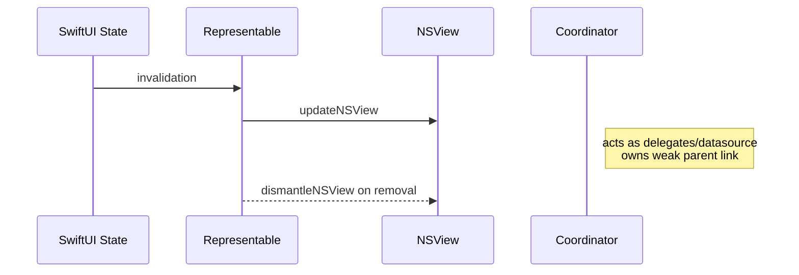

# apple-uikit-appkit-bridge

This Skill equips Claude to **design, generate, audit, and test** hybrid SwiftUI + UIKit/AppKit codebases.
It includes:
- Reference docs & lifecycle diagrams
- Code generators (Python)
- Memory & migration analyzers
- Complete, production-grade Swift examples for iOS and macOS
- Testing templates and best practices

> **Goal**: Make incremental SwiftUI adoption safe, testable, and ergonomic across Apple platforms.

---

## Overview

SwiftUI interoperates bi‑directionally with UIKit (iOS) and AppKit (macOS). This Skill focuses on:
- **Bridging Views** via `UIViewRepresentable` and `NSViewRepresentable`
- **Hosting Controllers** (`UIHostingController` and `NSHostingController`) for embedding SwiftUI in legacy hierarchies
- **Coordinator Pattern** to wire delegates, data sources, and target–action
- **Lifecycle** (creation, updates, cleanup) with `make*`, `update*`, `dismantle*`
- **Bridging Events & State**: NotificationCenter, KVO + Combine, gestures, responder chain navigation
- **Performance & Memory**: Identity, diffing, update minimization, avoiding retain cycles
- **Migration Strategy**: Gradually move from legacy controllers and views to SwiftUI
- **Testing**: XCTest patterns for hybrid UIs

Use this Skill when you must **reuse** mature UIKit/AppKit controls (e.g., `UITableView`, `MKMapView`, `WKWebView`, `NSTableView`), or when embedding SwiftUI views into an existing codebase.

---

## When to Use Bridges vs Rewrite

**Bridge when:**
- A feature is stable & complex in UIKit/AppKit and would be risky to rewrite.
- You need platform features not yet exposed by SwiftUI.
- You are migrating incrementally and want to keep release cadence.
- A team shares code across iOS/macOS using the same underlying component.

**Rewrite when:**
- The UI is simple or already being redesigned.
- You want SwiftUI features (composability, state-driven animations) that would require a net-new architecture anyway.
- Long‑term maintenance favors SwiftUI (smaller surface, fewer delegates).

**Rule of thumb**: Bridge first to unlock value; rewrite only when the ROI is clear.

---

## UIViewRepresentable Deep Dive (iOS)

`UIViewRepresentable` adapts a `UIView` for SwiftUI. Implement:
- `makeUIView(context:)` → create & configure once
- `updateUIView(_:context:)` → synchronize SwiftUI state to the view
- `makeCoordinator()` → return helper object for delegates/targets (optional)
- `static dismantleUIView(_:coordinator:)` → cleanup observers, delegates



**Identity**: Keep a consistent `UIView` instance to avoid unnecessary re‑creation. Push data diffs via `updateUIView`.

**Common pitfalls**:
- Mutating the view in `makeUIView` only; remember to update in `updateUIView` when bindings change.
- Creating cycles: store `weak` references in coordinators.

---

## NSViewRepresentable Deep Dive (macOS)

`NSViewRepresentable` adapts `NSView` for SwiftUI. Implement analogs:
- `makeNSView(context:)`
- `updateNSView(_:context:)`
- `makeCoordinator()`
- `static dismantleNSView(_:coordinator:)`



macOS often prefers **delegation over target–action**; rely on `Coordinator` to proxy events into SwiftUI.

---

## Coordinator Pattern

Use a nested `Coordinator` class to bridge delegates/data sources and avoid tight coupling.
- Store a **`weak var parent`** to prevent retain cycles.
- Marshal delegate callbacks into **bindings**, **closures**, or **Combine** publishers.

```swift
final class Coordinator: NSObject, UITableViewDelegate, UITableViewDataSource {
    weak var parent: TableBridge
    init(_ parent: TableBridge) { self.parent = parent }
    func tableView(_ tableView: UITableView, didSelectRowAt indexPath: IndexPath) {
        parent?.onSelect?(indexPath.row)
    }
}
```

**Lifecycle**: Coordinator lives as long as the hosted view; refresh its properties in `update*` if they depend on SwiftUI state.

---

## Lifecycle Management

**UIKit/AppKit → SwiftUI lifecycle mapping**
- Create: `makeUIView` / `makeNSView`
- Update: `updateUIView` / `updateNSView`
- Teardown: `dismantleUIView` / `dismantleNSView` (remove observers, nil delegates)
- SwiftUI `onAppear`/`onDisappear` complements representable lifecycle but is not the same.

**Order guarantees**:
- `update*` is called after `make*` and on any relevant state change.
- `dismantle*` is called before removal from the hierarchy.

---

## UIHostingController Usage (Embed SwiftUI in UIKit)

`UIHostingController<Content>` hosts SwiftUI views in UIKit hierarchies. Preferred for **incremental adoption** inside existing view controllers and storyboards. Typical steps:
1. Instantiate `UIHostingController(rootView:)`
2. Add as child view controller
3. Pin constraints to container
4. Keep the hosting controller **alive** as long as its view is on screen

See `examples/ios/UIHostingControllerIntegration.swift` for a reusable helper.

---


## UIKit 26 Updates: `updateProperties` and New APIs

With iOS 26, UIKit gained several APIs that improve bridging with SwiftUI and state observation:

- **`UIView.updateProperties()`**, **`setNeedsUpdateProperties()`**, and **`updatePropertiesIfNeeded()`** — These methods allow a view to update its properties in response to observed changes **before** `layoutSubviews` runs. Use `updateProperties()` to apply any property updates that depend on tracked state. Call `setNeedsUpdateProperties()` whenever your view’s observed state changes. This method coalesces multiple updates, and the system will call `updateProperties()` at the next appropriate time. You can also force an immediate update via `updatePropertiesIfNeeded()`【876470302211801†L2688-L2706】.
- **SwiftUI `@Observable` integration** — When using the Swift `@Observable` macro in a model class, UIKit views can register as observers and call `setNeedsUpdateProperties()` when observed properties change. This provides automatic observation without manually implementing KVO. Inside your `UIView` subclass, override `updateProperties()` to read from your observable model and update colors, fonts, etc.
- **`flushUpdates` animation option** — A new option for `UIViewPropertyAnimator` and `UIView.animate` that forces trait and property updates to flush before running animations. Use this when you need the latest layout or environment changes to be applied immediately before an animation begins.
- **New utility views and structures** — iOS 26 adds `UIBackgroundExtensionView` (extend your view’s background into safe areas), `UICornerConfiguration` (expressive corner radii per corner), and `LayoutRegion` (define explicit layout regions). Consider these when implementing complex custom containers.

When bridging to SwiftUI with `UIViewRepresentable`, you can take advantage of these APIs by performing property updates in `updateUIView` and signalling `setNeedsUpdateProperties()` from your SwiftUI state observers. Always guard usage with `@available(iOS 26.0, *)` and test on older OS versions.
## NSHostingController Usage (Embed SwiftUI in AppKit)

Use `NSHostingController` to host SwiftUI inside AppKit windows/views. On macOS, ensure proper **Auto Layout** constraints or view sizing using `intrinsicContentSize`/`fittingSize`. See `examples/macos/NSHostingControllerIntegration.swift`.

---

## Delegate Bridging

Most UIKit/AppKit controls expose their behaviors via delegates.
- Implement delegate protocols in `Coordinator`.
- Pass the coordinator to the view (`view.delegate = context.coordinator`).
- Forward events into SwiftUI via `@Binding`, closures, or `ObservableObject`.

Patterns are demonstrated for `UITableView`, `MKMapView`, `WKWebView`, and `NSTableView` in `examples/`.

---

## DataSource Bridging

Feed data to legacy views using a coordinator as **data source**. Maintain a **source of truth** in SwiftUI; the coordinator mirrors it into the bridged view while avoiding infinite loops (compare old/new snapshots before reloading).

---

## Gesture Recognizer Integration

Attach `UIGestureRecognizer` / `NSGestureRecognizer` inside `make*`, forward events through coordinator callbacks, and keep recognizer targets weak.
SwiftUI gestures are often sufficient, but legacy views (e.g., `MKMapView`) may still require recognizers for fine control.

---

## Responder Chain Navigation

Occasionally you must access the **owning view controller** or traverse the responder chain. Provide a utility to discover `UIResponder.next` (or `NSResponder.nextResponder`) until a desired type is found. Use sparingly to avoid tight coupling.

---

## NotificationCenter Bridging

In representables, register for system notifications (keyboard, window, app lifecycle) via **Combine publishers** or classic observers. Always remove observers in `dismantle*`.

---

## KVO/KVC Integration

For KVO‑compliant properties (e.g., `WKWebView.estimatedProgress`), use Combine’s `publisher(for:)` to observe and forward changes safely into SwiftUI state, and cancel in `dismantle*`.

---

## Frame vs Bounds in Hybrid Layouts

- **SwiftUI** proposes sizes top‑down; representables must report appropriate sizing (use `sizeThatFits` on macOS, or rely on Auto Layout/intrinsic size on iOS).
- **Frame** (in parent’s coordinate space) vs **bounds** (local space) matters for gesture anchors and hit‑testing. Set content modes and constraints accordingly.

---

## View Lifecycle Differences (UIKit/AppKit vs SwiftUI)

- UIKit/AppKit lifecycles are controller/view‑centric and **imperative**.
- SwiftUI’s lifecycle is **declarative**, driven by state diffs.
- Avoid keeping redundant mutable state in both worlds; prefer **single source of truth** in SwiftUI or a dedicated model object.

---

## Performance Considerations

- **Avoid re‑creation**: keep view identity stable (don’t depend on transient IDs).
- **Throttle updates**: compare new/old values in `update*` before expensive work.
- Use platform‑native **diffable data sources** for large tables/collections.
- Offload heavy computation off the main thread; deliver UI updates on main.

---

## Memory Management

- Use `weak` references in coordinators and gesture targets.
- Break cycles in closures (`[weak self]` capture lists) and invalidate timers/observers in `dismantle*`.
- Validate deallocation with `deinit` logs while developing.
- Prefer structs/value types for configuration where possible.

---

## Migration Strategies (Legacy → SwiftUI)

1. **Inventory**: Classify screens by complexity/risk.
2. **Embed SwiftUI islands** with `UIHostingController`/`NSHostingController`.
3. **Wrap complex legacy views** via representables (table/map/web).
4. **Move business logic** into platform‑agnostic models.
5. **Replace gradually**: start with leaf nodes; converge toward SwiftUI navigation & state.
6. **Introduce tests** at each step (unit + UI).

`docs/migration-strategies.md` contains a decision matrix and templates.

---

## Testing Hybrid Code

- Unit‑test coordinators (pure delegates/data sources are fast and deterministic).
- Snapshot/behavior tests using `UIHostingController` and XCTest expectations.
- UI tests exercise accessibility tree (works for UIKit & SwiftUI).

Templates live under `templates/testing/`.

---

## Best Practices

- Keep representables **thin**: configuration in `update*`, side effects in coordinator.
- Convert notifications/KVO to Combine where practical.
- Encode **intents** as closures/bindings instead of reaching through responder chain.
- Document teardown behavior in `dismantle*` to prevent leaks.

---

## Anti‑Patterns

- Retain cycles between view ↔ coordinator ↔ delegates.
- Updating UIKit/AppKit view directly from SwiftUI **outside** `update*`.
- Storing long‑lived state inside `UIView`/`NSView` instead of a model.
- Ignoring identity → leading to re‑creation and performance issues.

---

## Troubleshooting

- **`update*` not called**: ensure inputs are `@Binding`/stateful; avoid shadow copies.
- **Repeated re‑creation**: check view identity and `Equatable` conformance if used.
- **Gesture conflicts**: coordinate priorities; consider disabling SwiftUI gestures.
- **Layout glitches**: pin constraints for hosting controllers; use `sizeThatFits` on macOS representables.

---

## Real‑World Patterns (Examples Provided)

- `UITableView` with delegate/data source and selection binding
- `MKMapView` with binding to visible region & annotation sync
- `WKWebView` with progress KVO and policy decisions
- `NSTableView` with AppKit data source/delegate
- Gesture recognizers for map zoom/long‑press actions
- NotificationCenter keyboard handling for scroll views
- Responder chain utilities to find hosting controllers
- Memory‑safe coordinators (`weak` parent; cleanup in `dismantle*`)
- Before/After migration samples

See `examples/` for complete code.

---

## How Claude Uses This Skill

- Reads these patterns to **plan** interoperability tasks.
- Uses `scripts/` to scaffold new bridges and coordinators.
- Runs analyzers to flag **retain cycles** and migration hotspots.
- Pulls from `templates/` to stay consistent with best practices.

---

## References (selected)

- Apple Docs: UIViewRepresentable / NSViewRepresentable, Hosting Controllers, Coordinator, dismantle methods
- WWDC sessions on SwiftUI + UIKit/AppKit interop
- Combine KVO & NotificationCenter publishers
- Community articles on coordinator usage and testing strategies

> Full links are included in `/docs/*.md` files.

---

## License

MIT License. See repository root.
