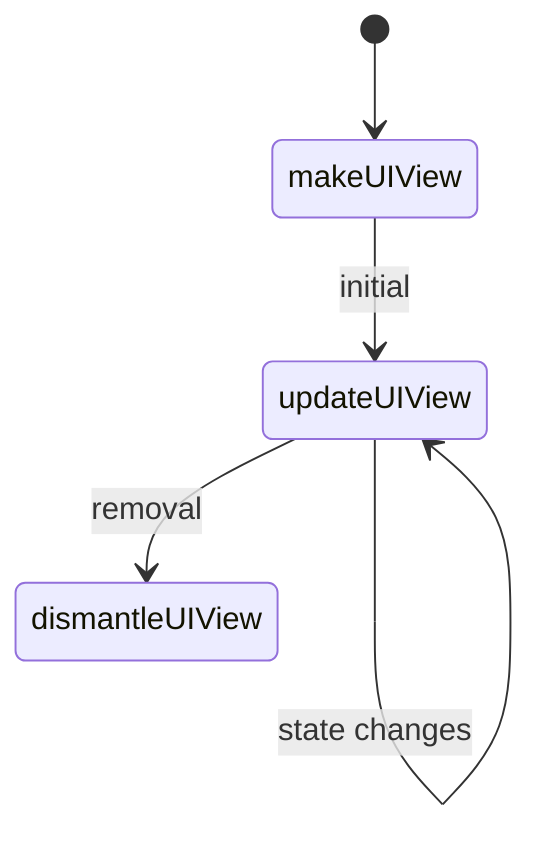

# UIViewRepresentable Guide

## Purpose
`UIViewRepresentable` adapts a `UIView` into SwiftUI. Implement `makeUIView`, `updateUIView`, optional `makeCoordinator`, and `dismantleUIView` for cleanup.

## Lifecycle

## Tips
- Keep identity stable; only update what changed.
- Use a `Coordinator` for delegates or target–action.
- Remove observers/delegates in `dismantleUIView`.
