# Beautiful Mermaid — Craft Agent Diagram Guide

Craft Agent renders Mermaid diagrams using **beautiful-mermaid**, a custom renderer
that produces clean, themed SVGs. It is NOT standard Mermaid — it has a different
layout engine (ELK.js instead of dagre), different default styles, and a sophisticated
automatic theming system. Diagrams that look fine in standard Mermaid can look wrong
here, and vice versa.

**This skill supersedes the general `mermaid.md` reference.** If you see conflicting
guidance about custom fills or styles elsewhere in context, follow THIS skill's
guidance — beautiful-mermaid's theme system handles colors automatically and custom
styling breaks it.

## Local Hermes setup

On Kosta's Mac Studio, `beautiful-mermaid@1.1.3` is installed under `~/.hermes/tools/beautiful-mermaid/` with a stable wrapper on PATH:

```bash
render-beautiful-mermaid -i diagram.mmd -o diagram.svg --theme github-light
render-beautiful-mermaid -i diagram.mmd -o diagram.txt --ascii
```

The library emits SVGs that use CSS variables, so ImageMagick may fail to rasterize them directly. For PNG output, render the SVG in Chrome/headless browser and screenshot it, or send the SVG when the platform supports it.

## Quick Rules

1. **Six supported diagram types**: flowchart, state, sequence, class, ER, xychart-beta
2. **Let the renderer handle all colors.** It derives fills, strokes, and text from the
   user's active theme (a two-color system). Adding custom `fill`, `stroke`, or `color`
   via `style` or `classDef` creates jarring contrast — like painting one wall of a
   coordinated room a random color.
3. **Prefer vertical layouts for long process flows** (`graph TD`) — they read like a
   step-by-step procedure and avoid ultra-wide PNGs that get shrunk into unreadability.
   Use horizontal layouts (`graph LR`) for short flows, compact system maps, and diagrams
   with only a few stages.
4. **Keep diagrams focused** — 10-15 nodes maximum per diagram. Split larger concepts
   into multiple smaller diagrams; the UI handles several small diagrams much better
   than one dense one.
5. **Validate with `mermaid_validate`** when diagrams have subgraphs, 8+ nodes, or
   special characters in labels

## Common Pitfalls (and What to Do Instead)

### Let the theme system work — skip custom fills


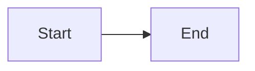

The renderer derives a full color palette from just two values (background + foreground).
Every node fill is a subtle 3% tint of the foreground, every stroke is 20%, every arrow
head is 85%. Custom colors override this calibrated cascade and look like a foreign object
pasted onto an otherwise cohesive diagram. This applies to both `classDef` and inline
`style` directives.

**The one exception — `linkStyle`**: Highlighting a specific edge with `linkStyle` is
fine because it styles individual connectors rather than nodes. Since edges use a uniform
derived color, selectively coloring one edge (e.g., an error path) adds semantic meaning
without disrupting theme cohesion.

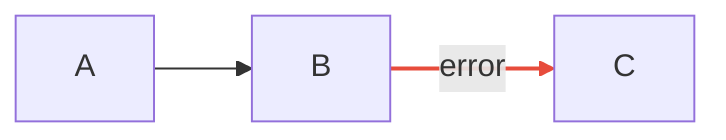

### Stick to the 6 supported types

Unsupported types (pie, gantt, mindmap, gitgraph, journey, quadrant, sankey, architecture)
will fail silently or produce garbage. Good alternatives:
- **Pie chart data** → `xychart-beta` bar chart or a `datatable` block
- **Gantt / timeline** → `datatable` or `spreadsheet` block with date columns
- **Mindmap** → indented markdown list
- **File/directory tree** → plain text ASCII tree

### Use semantic meaning through structure, not color

Since you can't color-code nodes, convey meaning through:
- **Node shapes** — diamonds for decisions, cylinders for databases, stadiums for I/O
- **Edge types** — dotted for optional, thick for critical paths
- **Labels** — descriptive text on edges and nodes
- **Subgraphs** — group related concepts visually

## Supported Diagram Types

### 1. Flowcharts (`graph` or `flowchart`)

Use `graph LR` for compact horizontal flows or `graph TD` for vertical flows. For long
process flows, prefer `graph TD` so the rendered PNG stays readable on phone and chat
surfaces instead of becoming a tiny ultra-wide strip.

**Node shapes:**

| Syntax | Shape |
|--------|-------|
| `A[text]` | Rectangle (sharp corners — NOT rounded like standard Mermaid) |
| `A(text)` | Rounded rectangle |
| `A{text}` | Diamond (decision) |
| `A([text])` | Stadium / pill |
| `A((text))` | Circle |
| `A[[text]]` | Subroutine (double-bordered) |
| `A[(text)]` | Cylinder (database) |
| `A{{text}}` | Hexagon |
| `A>text]` | Asymmetric flag |
| `A[/text\]` | Trapezoid |
| `A[\text/]` | Trapezoid (alt) |
| `A(((text)))` | Double circle |

**Edge types:**

| Syntax | Style |
|--------|-------|
| `-->` | Solid arrow |
| `---` | Solid line (no arrow) |
| `-.->` | Dotted arrow |
| `-.-` | Dotted line (no arrow) |
| `==>` | Thick arrow |
| `===` | Thick line (no arrow) |
| `<-->` | Bidirectional solid |
| `<-.->` | Bidirectional dotted |
| `<==>` | Bidirectional thick |
| `-->|text|` | Labeled edge (or `-- text -->`) |

**Subgraphs:**

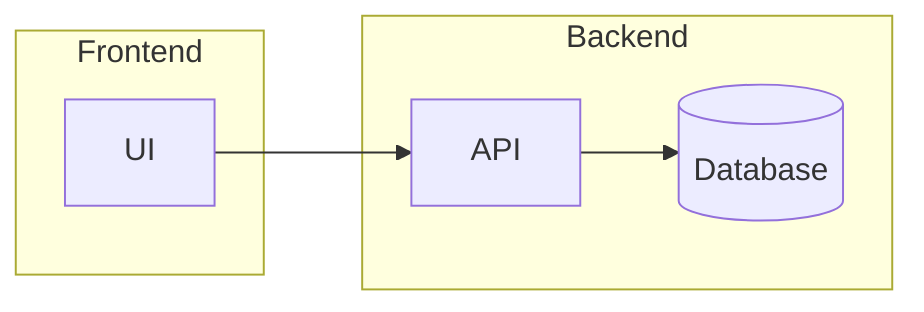

**Example — CI/CD Pipeline:**

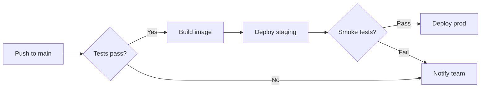

### 2. State Diagrams (`stateDiagram-v2`)

Always use `stateDiagram-v2` (not `stateDiagram`). Add `direction LR` for horizontal.

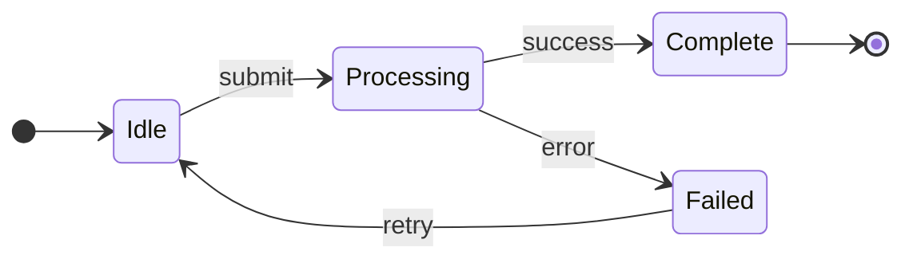

Composite states:

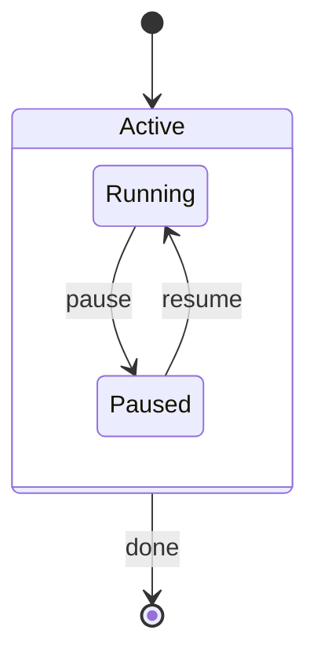

### 3. Sequence Diagrams (`sequenceDiagram`)

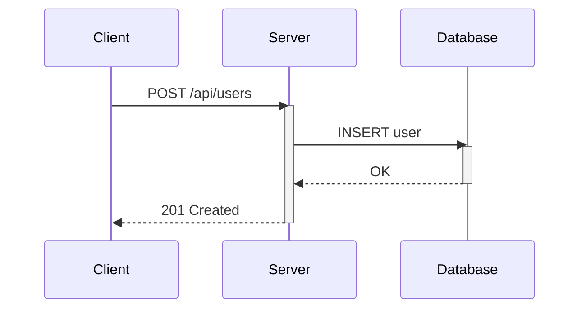

**Message types:**
- `->>` solid with filled arrow
- `-->>` dashed with filled arrow
- `-)` solid with open arrow (async)
- `--)` dashed with open arrow
- `-x` solid with X (lost/failed message)
- `--x` dashed with X

**Shorthand activation:** `->>+B` activates B, `-->>-B` deactivates B

**Blocks:** `loop`, `alt`/`else`, `opt`, `par`/`and`, `critical`, `break`, `rect`

**Notes:** `Note right of A: text`, `Note left of A: text`, `Note over A,B: text`

**Actors:** Use `actor B as Bob` for a person icon instead of `participant` (rectangle box)

### 4. Class Diagrams (`classDiagram`)

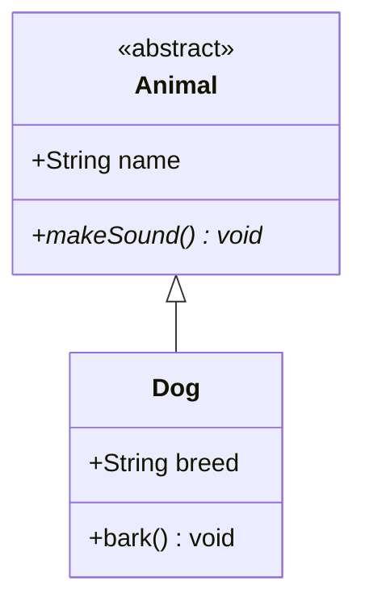

**Visibility:** `+` public, `-` private, `#` protected, `~` package

**Relationships:**

| Syntax | Meaning |
|--------|---------|
| `<\|--` | Inheritance (extends) |
| `*--` | Composition (contains) |
| `o--` | Aggregation (has) |
| `-->` | Association |
| `..>` | Dependency |
| `..\|>` | Realization (implements) |
| `--` | Link (solid) |
| `..` | Link (dashed) |

**Cardinality:** `Customer "1" --> "*" Order : places`

**Annotations:** `<<interface>>`, `<<abstract>>`, `<<singleton>>`, `<<enumeration>>`

### 5. ER Diagrams (`erDiagram`)

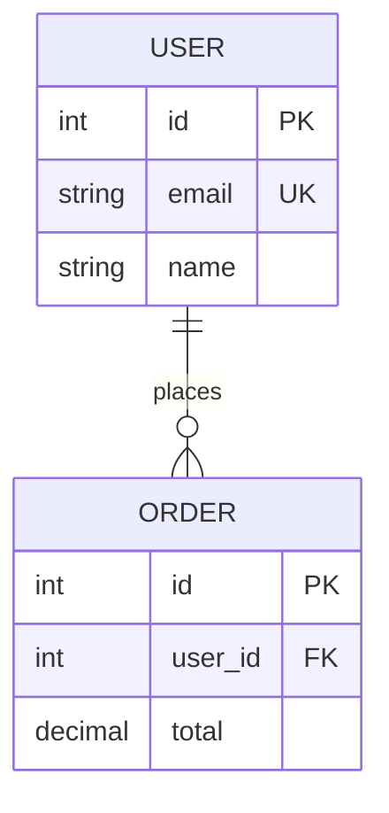

**Cardinality:** `||` exactly one, `o|` zero or one, `|{` one or more, `o{` zero or more

### 6. XY Charts (`xychart-beta`)

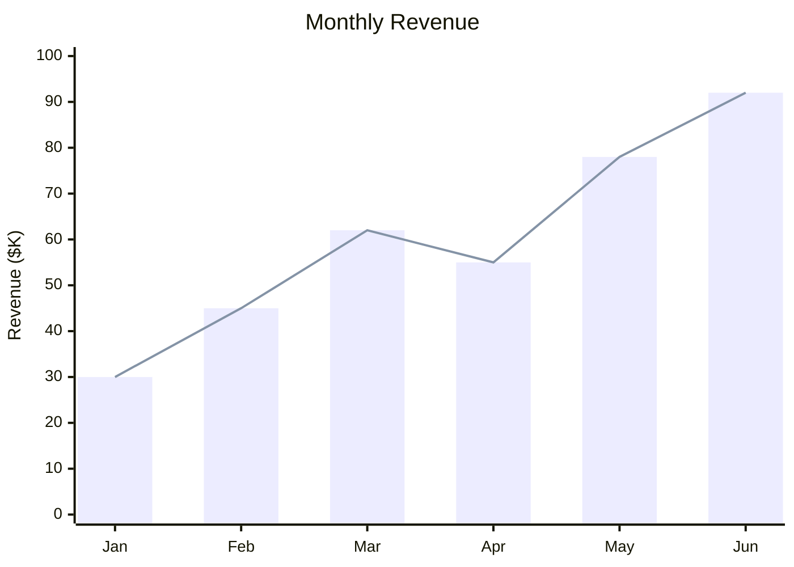

Beautiful-mermaid gives XY charts special visual treatment:
- **Dot grids** instead of solid grid lines (subtle, clean)
- **Rounded bars** with 8px radius on all corners
- **Natural cubic spline** interpolation for smooth line curves
- **Floating labels** with no visible axis lines or tick marks
- **Drop-shadow lines** for depth

For horizontal bars: `xychart-beta horizontal`

## Inline Text Formatting

These formatting tags work in flowchart node labels and edge labels. Support in other
diagram types varies — test with `mermaid_validate` if unsure.

- `<b>bold</b>` or `**bold**`
- `<i>italic</i>` or `*italic*`
- `<u>underline</u>`
- `<s>strikethrough</s>` or `~~strikethrough~~`
- `<br>` or `\n` for line breaks

Tags like `<sub>`, `<sup>`, `<small>`, `<mark>` are stripped by the renderer.

## Layout Tips

- **Prefer vertical for long process flows** — `graph TD` reads naturally as a procedure
  and survives chat/phone PNG scaling better than a very wide `graph LR` strip
- **Use horizontal for compact maps** — `graph LR` is still good for short flows, system
  maps, and diagrams with only a few major stages
- **Chained edges** (`A --> B --> C --> D`) create clean linear flows
- **Parallel links** (`A & B --> C & D`) for fan-out/fan-in patterns
- For sequence diagrams, keep participant count to 4-6 — split beyond that
- Use subgraphs to group related nodes, but avoid nesting more than 2 levels deep

## Escaping Special Characters

Wrap labels with special characters in quotes:

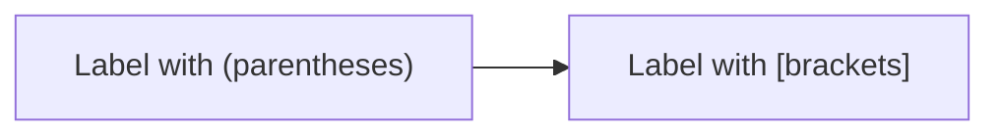

## Validation

```
mermaid_validate({ code: "graph LR\n  A --> B" })
```

Use `mermaid_validate` for any diagram with subgraphs, 8+ nodes, or special characters
in labels. It catches syntax errors before the user sees a broken diagram.

## Better Alternatives for Some Visualizations

Sometimes mermaid isn't the best tool:
- **Tabular data** → `datatable` or `spreadsheet` code blocks
- **File trees** → plain text ASCII tree
- **Simple comparisons** → markdown tables
- **Pie chart data** → `xychart-beta` bars or a `datatable`
- **Gantt / timeline** → `datatable` or `spreadsheet` with date columns
- **Mindmap** → indented markdown list

## Reference Files

- `references/theming-and-internals.md` — Read when debugging visual issues, when the
  user asks why a diagram looks wrong, or when you need to understand the two-color
  derivation system in detail. Also covers all 15 built-in themes and fixed style constants.
