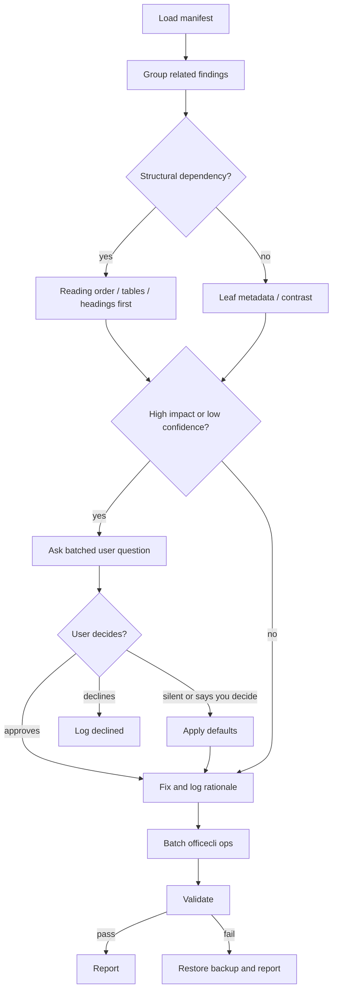

# Stage 4 Office accessibility remediation

This skill stacks on top of the OfficeCLI base skills. Use those for general navigation and schema details; use this skill only for residual accessibility decisions. The companion skill names depend on how they were installed: officecli's own installer creates `pptx` / `word`; skillshare installs them as `officecli-pptx` / `officecli-docx`. OfficeCLI docs to re-read when needed: https://github.com/iOfficeAI/OfficeCLI, https://github.com/iOfficeAI/OfficeCLI/wiki/Command-Reference, https://github.com/iOfficeAI/OfficeCLI/wiki/Word-Reference, https://github.com/iOfficeAI/OfficeCLI/wiki/PowerPoint-Reference, and https://github.com/iOfficeAI/OfficeCLI/wiki/command-batch.

## Minimum-impact mandate

The goal is ADA compliance, NOT redesign. For every finding, prefer the smallest possible edit that satisfies the WCAG criterion.

- Prefer metadata edits (alt text, header flags, language tags) over structural edits.
- Never change colors, fonts, sizes, or positions unless the rule REQUIRES it.
- For contrast: propose the smallest delta that crosses the threshold; never re-theme. If the design system can't accommodate, defer to the user.
- For reading order: re-order shapes via `swap` / `move`, never delete or recreate.
- For tables: prefer setting header flags over restructuring. Only restructure when merged cells make headers ambiguous AND the user explicitly approves.
- If two viable fixes exist, pick the one with zero visual diff.
- When in doubt, flag and ask — do not "improve" beyond compliance.

## Property verification rule

Before writing a property you have not used in this session, verify the property name on the target element type. OfficeCLI's own SKILL.md mandates this:

```bash
officecli help docx set picture
officecli help pptx set picture
officecli help docx set hyperlink
```

The output lists supported properties for that element. If a property you assumed isn't there, fall through to `raw-set` against the verified OOXML attribute (e.g. `descr` for alt text on `<a:cNvPr>`), and document the fallback in the change log.

## Inputs and first action

The user supplies a `.docx` or `.pptx` and a JSON manifest. Each finding has `id`, `rule_id`, `severity`, `location`, `current_value`, `why_human_needed`, and `related_findings_ids`. Validate the shape against `schemas/input-manifest.schema.json`, then run:

```bash
python scripts/triage.py manifest.json --json
```

Work the grouped plan, not the raw list. Use `officecli get`, `view`, `watch`, `goto`, and `mark` to inspect context. Use MCP mode (`officecli mcp`) only when Claude Code is already operating through MCP and benefits from persistent tool calls; otherwise use explicit CLI commands because they leave auditable terminal history.

## Triage

Sort by impact, dependency, then decision cost. Fix structure before leaves: reading order, table structure, headings, then contrast, alt/link/title metadata. Group related findings by slide, table, paragraph cluster, or shared `related_findings_ids`; one reading-order decision for a slide beats five prompts.



## Decision frameworks

Load `references/wcag-mapping.md` for ADA/WCAG/Section 508 grounding and `references/decision-defaults.md` before ambiguous calls.

| Issue | Reasoning procedure |
|---|---|
| Reading order | Compare visual layout, text semantics, speaker flow, and slide/object hierarchy. Commit when order is obvious from title-to-body-to-note flow. Ask when multiple narratives are plausible. WCAG 1.3.2. |
| Headings | Preserve semantic outline, not visual size. Promote a styled paragraph when it introduces a section and users would navigate to it. Avoid skipped levels unless the surrounding outline proves it is intentional. WCAG 1.3.1, 2.4.6, 2.4.10. |
| Contrast | Resolve theme colors and effective background before changing anything. Use `scripts/contrast.py`; prefer nearest design-token fix, background adjustment, or shape fill change over bluntly darkening text. WCAG 1.4.3, 1.4.11. |
| Complex tables | Decide whether the table is data, layout, or hybrid. Data tables get headers and minimal merge repair; layout-only tables should be flattened only when the manifest targets that table and reading flow improves. WCAG 1.3.1. |
| Decorative images | If removing the image would not change meaning, mark decorative. If it conveys data, action, identity, or mood the author likely intended, keep informative alt. WCAG 1.1.1. |
| Floating objects | Inline when the object belongs at a text insertion point; preserve floating when it is an intentional callout, watermark, or side illustration. WCAG 1.3.2. |
| Link text | Replace low-confidence labels only when destination and surrounding sentence prove the purpose. Otherwise ask. WCAG 2.4.4 by practice, 2.4.6 for labels. |
| Merged cells | Split only when merges obscure headers or linear reading. Preserve merges that express grouped categories, totals, or visual hierarchy. WCAG 1.3.1. |

## OfficeCLI accessibility cookbook

Use `references/officecli-a11y-cheatsheet.md` for exact variants. Common commands:

```bash
officecli set deck.pptx /slide[1]/picture[1] --prop alt="Sales funnel diagram"
officecli set report.docx '/body/p[3]/picture[1]' --prop alt="CEO speaking at town hall"
officecli set deck.pptx /slide[2]/picture[3] --prop decorative=true
officecli set report.docx /body/tbl[1]/tr[1] --prop header=true
officecli set report.docx /body/p[8] --prop style=Heading2
officecli set report.docx /body/p[12]/hyperlink[1] --prop text="Download the benefits guide"
officecli swap deck.pptx '/slide[3]/shape[2]' '/slide[3]/shape[5]'
officecli set deck.pptx /slide[4]/table[1]/tr[2]/tc[1] --prop gridSpan=1 --prop rowSpan=1 --prop hmerge=false --prop vmerge=false
officecli set deck.pptx '/slide[2]/shape[name=Title 1]' --prop text="Quarterly risk summary"
officecli set report.docx / --prop title="2026 Benefits Guide"
officecli batch report.docx --input a11y.commands.json --json
officecli validate report.docx --json
```

Use batch mode for multiple writes to the same file. After each structural batch, validate. Use `raw`, `raw-set`, or `add-part` only when the schema cannot express the property; first inspect with `officecli get` or `raw` and document why schema ops were insufficient.

## User interaction

High-confidence, low-impact changes can be fixed and logged. Low-confidence or high-impact changes need a batched question. Use templates from `references/user-question-templates.md`. When the user is silent or says “you decide,” apply the documented defaults: favor inclusion, keep informative alt over decorative, keep header rows, preserve author intent, and defer destructive restructures.

## Safety and idempotency

Make a backup copy before the first write. Trust the manifest; do not re-run upstream auto-fixes or re-detect the document. Modify only locations tied to findings. Prefer schema operations over raw XML because OfficeCLI validates and normalizes them. If validation fails after a batch, restore the backup, report the failed commands, and stop editing. A re-run with the same manifest should no-op any change already present.

## Reporting

End with a one-paragraph executive summary suitable for a compliance ticket, then a terminal table. Also write JSON matching `schemas/output-report.schema.json` with `changes_committed`, `changes_user_approved`, `changes_user_declined`, `items_deferred`, `wcag_criteria_addressed`, `validation_status`, and `file_backup_path`. Use `scripts/report.py` when a JSONL change log exists.

### JSONL change-log shape (required by `scripts/report.py`)

When you commit, ask, defer, or apply a default, append one JSON object per line to the log file. `report.py` filters by `type` and expects these keys:

```jsonl
{"type": "change",         "finding_id": "f-001", "rule_id": "ALT_MISSING",     "location": "/slide[1]/picture[2]", "operation": "set alt", "before": "", "after": "Sales funnel diagram", "rationale": "Single subject, low-confidence stage-3 deferred.", "wcag_criteria": ["1.1.1"], "decision_source": "high_confidence", "timestamp": "2026-05-01T..."}
{"type": "user_approved",  "finding_id": "f-002", "rule_id": "READING_ORDER",   "location": "/slide[3]",            "question": "Read title → chart → footnote → CTA?", "user_response": "yes", "operation": "swap", "before": "...", "after": "...", "wcag_criteria": ["1.3.2"], "timestamp": "..."}
{"type": "user_declined",  "finding_id": "f-003", "rule_id": "CONTRAST",        "location": "/slide[2]/shape[5]/run[1]", "question": "Darken text by 8% to hit 4.5:1?", "user_response": "no", "wcag_criteria": ["1.4.3"], "timestamp": "..."}
{"type": "deferred",       "finding_id": "f-004", "rule_id": "MERGED_CELLS",    "location": "/body/tbl[2]",         "reason": "Splitting may break author intent; needs human.", "wcag_criteria": ["1.3.1"], "timestamp": "..."}
```

`decision_source` ∈ `high_confidence` | `user_approved` | `default_policy` | `escalated`. Always carry `finding_id` so `report.py` can link entries back to the manifest.

### Propagating `finding_id` through batch ops

OfficeCLI batch entries ignore unknown fields, so it's safe (and required) to add a `_finding_id` key to each batch command. `apply_batch.py` preserves these into the JSONL; `report.py` reads them. Example:

```json
[
  {"_finding_id": "f-001", "command": "set", "path": "/slide[1]/picture[2]", "props": {"alt": "Sales funnel diagram"}},
  {"_finding_id": "f-005", "command": "set", "path": "/body/tbl[1]/tr[1]",   "props": {"header": "true"}}
]
```

Without `_finding_id` propagation every committed change shows up in the report as `finding_id: "unknown"`.

## "view issues" is read-only

`officecli view <file> issues` is a read-only inspection of OfficeCLI's surface checks — it does NOT re-detect against the upstream rule catalog. Use it to glance at the document, not to drive new findings. Stay strictly within the manifest's `residual_findings` list. The safety rule "never re-run upstream detection" still holds.

## Worked examples

1. Manifest flags `/slide[3]` reading order. `get` shows title, chart, footnote, then CTA button visually. Ask once: “I see slide 3 should read title, chart, footnote, then CTA. Apply that order?” If approved, use `swap` or `move`, batch, validate, log WCAG 1.3.2.

2. Manifest flags `/body/p[8]` as a visual heading after `Heading1` and before `Heading3`. It introduces “Eligibility.” Fix without asking: `officecli set report.docx /body/p[8] --prop style=Heading2`; validate; log WCAG 1.3.1 and 2.4.10.

3. Manifest flags logo alt as low-confidence. It repeats the company name already in adjacent text and adds no new purpose. Ask: “This appears decorative because the neighboring heading already says Acme Health. Mark decorative, or keep alt?” If silent, keep a short alt rather than deleting meaning.

4. Manifest flags `Click here`. Destination is a benefits PDF and sentence says “For enrollment rules.” Fix: `officecli set report.docx /body/p[12]/hyperlink[1] --prop text="Read enrollment rules"`; log WCAG label impact.
